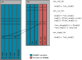
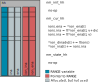

Ions
====

NEURON supports computing the ion currents and ion concentrations. For each segment
there can be separate current for separate ions, i.e. one for sodium ions and
another for calcium ions.

There are five variables associated with ions: the current (``ina``), the
concentration inside the segment adjacent to the membrane (``nai``), the
concentration outside the segment adjacent to the membrane (``nao``), the
reversal potential (``ena``) and the derivative if the current w.r.t. the
voltage (``dinadv``). The names should be split as ``i{na}`` and therefore
refer to the value for sodium, for calcium it would have been ``ica``.

These variables are physical properties of the segment. Therefore, there exists
one mechanism per ion. MOD files can include code to read or write these
variables.

NDMOL Keywords
--------------
A MOD file seeking to use ions should use ``USEION`` as follows:

.. code::

  NEURON {
     USEION na READ ina WRITE ena
  }

  ASSIGNED {
    ena (mV)
    ina (mA / cm2)
  }

Multiple ions are expressed by one line of ``USEION`` per ion.

The ``{ion_name}`` is a string giving the ion a name. For sodium it's ``na``
and for calcium ``ca``. If the no other mechanisms have defined an ion with
this name a new ion mechanism is created.

Both ``READ`` and ``WRITE`` are optional and are followed by a comma separated
list of ion variable names, e.g. ``ina, ena``.

Keyword: WRITE
~~~~~~~~~~~~~~

Writing Ion Currents
^^^^^^^^^^^^^^^^^^^^

In MOD file one can set the value of ion variables.

.. code::

  BREAKPOINT {
    ina = gna*(v - ena)
  }

Semantically, this states that the contribution of the Hodgkin-Huxley model to
the overall sodium current in that segment is ``gna*(v - ena)``. Since
everything is at the level of segment, we'll not keep repeating "for that
segment". Similarly, each mechanism computes a `local` contribution, i.e. the
contribution due to this mechanism to the actual `global` ion current.

Therefore, code for the following must be generated:

1. Compute the local contribution to the sodium current.
2. Increment the total, local, current contribution by ``ina``.
3. Increment the global sodium current by ``ina``.
4. Compute local derivative of ``ina`` w.r.t. the voltage.
5. Increment the global derivative of the sodium current w.r.t. the voltage.

The global current must also be updated as usual. However, this isn't ion
specific and hence omitted.

Storage
-------

Each mechanism that specifies ``USEION na`` contains a copy of all used ion
variables and pointers to the shared values in the ion mechanism, see Figure 1.

The pointer to the variable in the ion mechanism is prefixed with ``ion_``,
e.g. during initialization we might copy the shared value ``*ion_ena[i]`` to
``ena[i]`` (the copy local to the mechanism using the ion).

   Figure 1: Ion mechanism for sodium (``na``) and its use in the
   Hodgkin-Huxley mechanism. This figure shows the NEURON memory layout.

Optimizing Storage
~~~~~~~~~~~~~~~~~~

Since the common pattern is to only access the values of a particular instance,
the local copy isn't needed. It might facilitate SIMD, but it could be replaced
by local variables to save memory, see Figure 2.

   Figure 2: Optimized ion storage layout.

This optimization is implemented in NMODL. It can be activated on the CLI via

.. code:: sh

   nmodl ... codegen --opt-ionvar-copy

Concentrations
--------------

Concentrations adjacent to the inside and outside of the membrane are computed.
MOD files can change the value by setting ``nai`` or ``nao``. It's considered
an error if two MOD files write the same concentration, which result in a
warning.

The reversal potential ``ena`` is a function of the two concentrations.
Therefore, when writing to either concentration, we must specify if ``ena``
needs to be recomputed.

Writing Concentrations
~~~~~~~~~~~~~~~~~~~~~~
When writing concentrations we must notify NEURON of two things: a) the fact
that this mechanism writes some concentration; b) that this instance of the
mechanism does so.

The former happens when registering the mechanism and controls the position of
the mechanism relative to others, i.e. mechanisms that write the concentration
must appear before mechanisms that only read the concentration, that way they
get to see the updated values. We must call ``nrn_writes_conc`` to inform
NEURON that this mechanisms write some concentration.

The latter notification happens as part of ``nrn_alloc``, i.e. when allocating
the ``Prop``, by calling ``nrn_check_conc_write``. This checks that there's no
conflict and modifies the "style" of the ion. We pass ``0`` for exterior and
``1`` for interior.

Ion Styles
~~~~~~~~~~
The style is a 12-bit wide bitfield and stored in the ``dparam`` array of the
``Prop`` as an ``int``.  It's stored at location ``0`` (variable name:
``iontype_index_dparam``) in the ``dparam`` array.

From MOD files we need to notify NEURON if we're reading/writing concentration
or reversal potential. This is done by calling ``nrn_promote(., conc, rev)``.
The magic value for ``rev`` and ``conc`` is ``1`` for reading and ``3`` for
writing.

Special Case: zero-area nodes
-----------------------------

Ions are not defined for nodes that represent a segment with zero area. This
means point processes can't use ions at nodes with surface zero-area.
Therefore, this should be asserted in generated code. It also allows converting
ion currents to ion current densities by dividing by the area.
